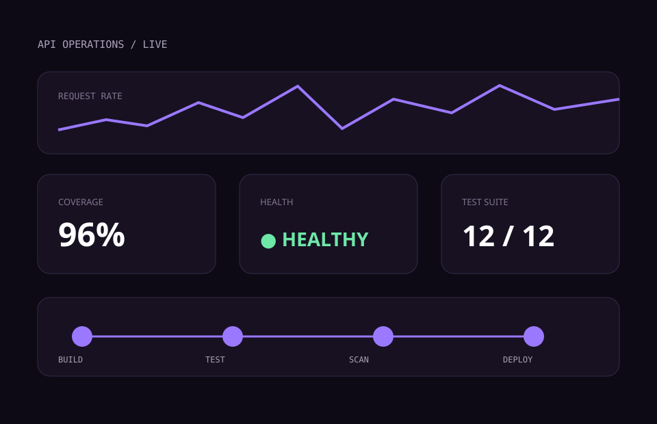

# DevOps FastAPI Lab

## Problema

Uma API demonstrativa só é uma boa prova técnica quando também pode ser testada, observada, implantada e recuperada de forma reproduzível.

## Solução

API FastAPI com CRUD idempotente, autenticação de mutações, logs estruturados, métricas, health checks e persistência SQLite adequada ao escopo do laboratório.

## Automações

- CI com testes, cobertura, Ruff e mypy;
- build e scan da imagem Docker;
- Dependabot para dependências e Actions;
- provisionamento local de Prometheus e Grafana;
- backup consistente, verificação de integridade e restauração atômica;
- request IDs, métricas por rota normalizada e probes separadas.

## Evidências

- [Repositório público](https://github.com/endeson12/devops-fastapi-lab)
- [Swagger em execução](https://devops-lab.76-13-234-134.sslip.io/docs)
- [Execuções da CI](https://github.com/endeson12/devops-fastapi-lab/actions)

## Limites

É um laboratório de uma réplica e não representa alta disponibilidade, carga real, clientes ou SLA. Escala horizontal exigiria outra estratégia de persistência e métricas.
