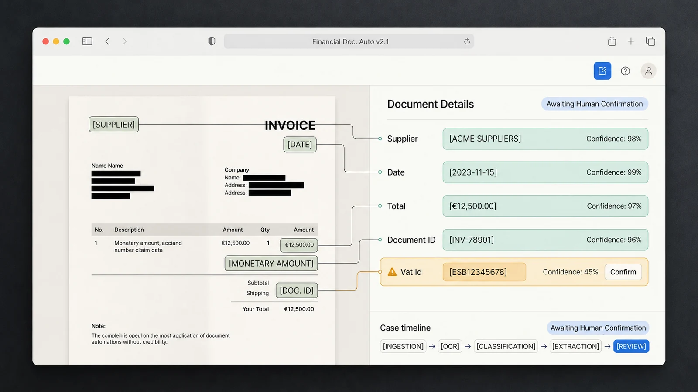

# Financial Document Automation


## Problema

Documentos financeiros recebidos em formatos diferentes exigem leitura, classificação, extração de campos e conferência antes de alimentar o controle operacional.

## Solução

Arquitetura com worker Python para ingestão e extração, portal Next.js para revisão e API de agente supervisionado. O PostgreSQL/Supabase mantém casos, documentos, pendências e estados de revisão.

## Automações

- observação de pasta e upload controlado;
- extração de texto de PDF e adaptadores de OCR;
- classificação com nível de confiança;
- extração de fornecedor, município, datas e valores;
- criação de casos e pendências para itens incompletos;
- ferramentas do agente separadas por domínio;
- fila explícita de revisão antes de confirmar ações.

## Arquitetura

```text
Fontes autorizadas -> Worker/OCR -> Extração e confiança
                                      |
                                      v
                              PostgreSQL/Supabase
                                      |
                    Portal de revisão <- API supervisionada
```

## Privacidade e limites

O código e os dados permanecem privados por tratarem de operação empresarial. Este estudo não publica documentos, fornecedores, credenciais, valores ou dados de usuários. OCR e extração assistida não substituem conferência humana.
